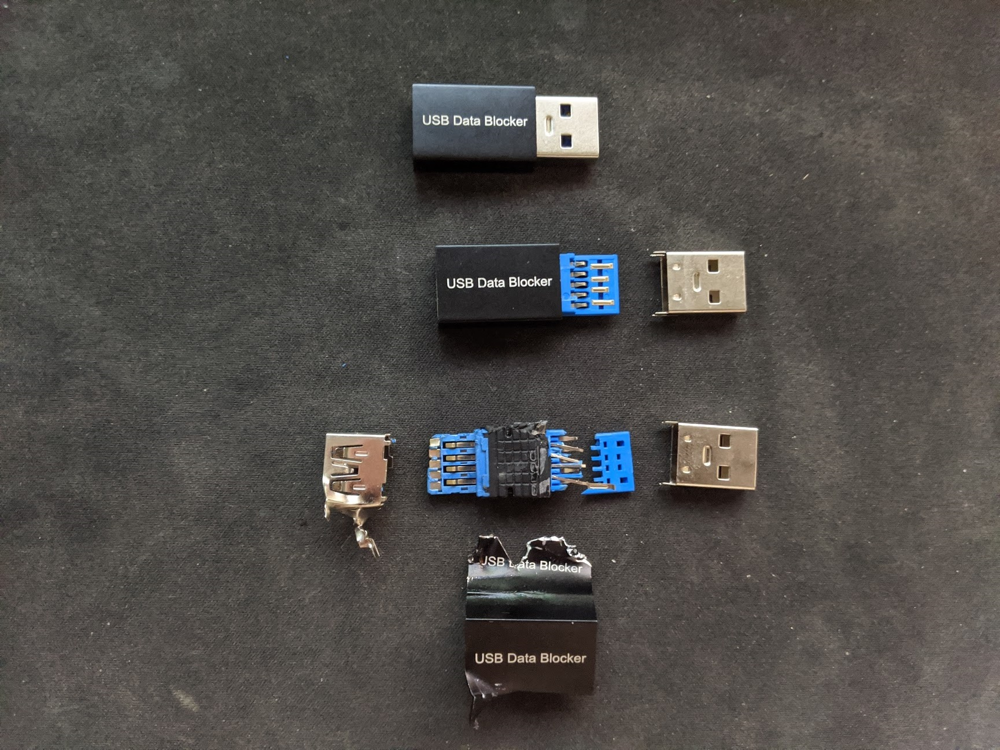
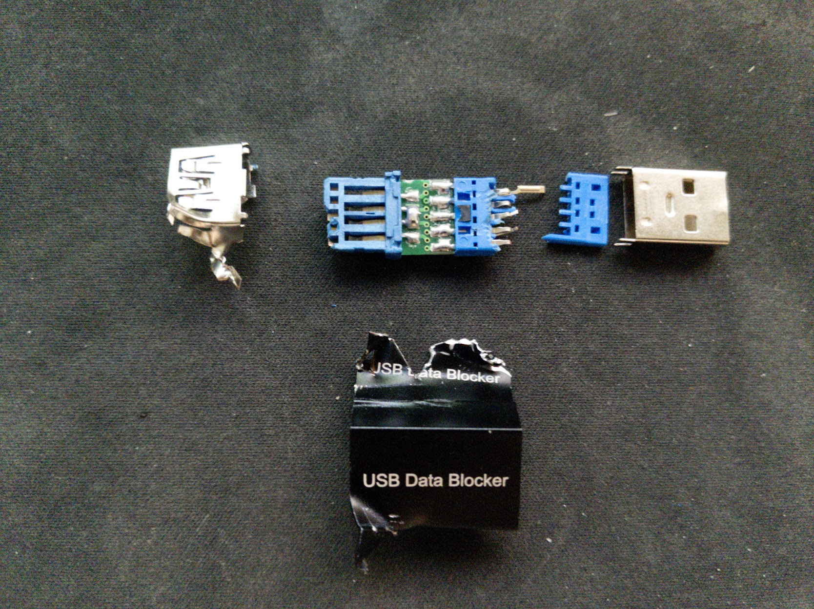
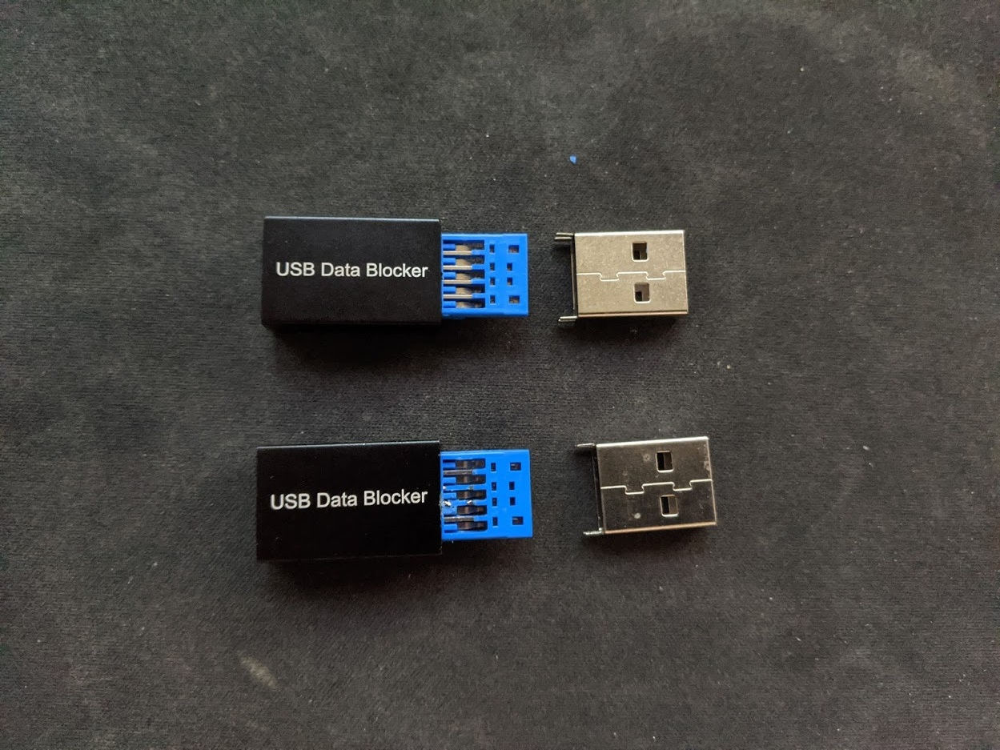

I've been slowly upgrading my workstation with the relevant hardware and since this is a server board, we don't have modern things like USB3 or HDMI ports. We're left with a VGA port that's uses the onboard gpu to output. I would like to get this working in the event of debugging due to the host OS being proxmos and I have MacOS + Windows guests.

I got the UGreen VGA to HDMI adapter (SKU 40213), this is a pretty nice adapter that has a USB interface for Power + Audio. The adapter will not work if you do not supply power via the USB cable. However when you do plug in the USB cable, it comes with an audio device output.

I connect/disconnect USB devices a lot and sometimes this makes Windows change the default audio output device. The idea is to use a USB Dongle that only supplies power so we can still get display. I bought this generic USB data blocker (GME02), paid a little more for it because I wanted the black colored dongles but you can get them for about a dollar or two.

Connecting the data blocker dongle with my device to the motherboard works fine. However when I connected it to my Dell U2715H monitor, the USB hub would reset. The data blocker dongle doesn't play nice with the monitor's USB hub so I decided to take one apart to find out why. In hindsight... I could have done this with my multimeter but hey. Destroying things I just bought is way more fun.

Comparing the dongles in different stages

The top is the normal dongle
The middle is a dongle with the metal plug removed
The bottom is obviously the dismantled dongle.

Here's a close-up of the dismantled dongle and we can see that the data lines are shorted. Doing a bit of research and found that the Chinese standard of marking a usb connection `charge only` is by shorting the data lines. The European standard consists of typically putting a 200 ohm resistor between the data lines. However, shorting the data lines should still fit the European standards.

Since the Dell monitor doesn't appreciate the data lines being shorted, I simply just snipped off the data lines for the rest of the dongles I have and all is good. The top dongle is what you get out of box, the bottom dongle you can see the two data lines in the middle snipped.

