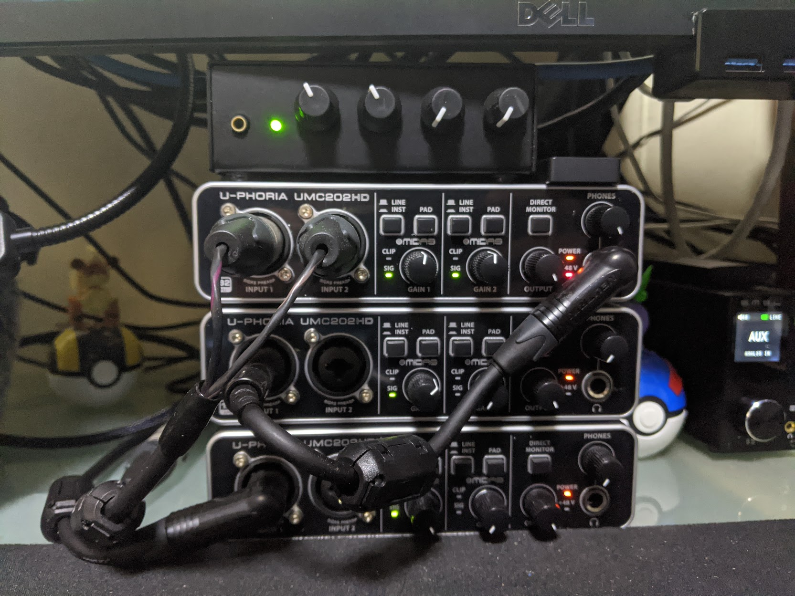
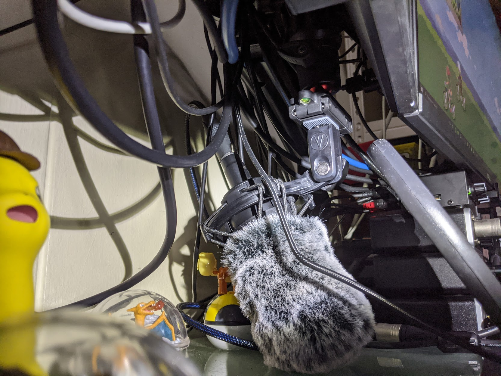
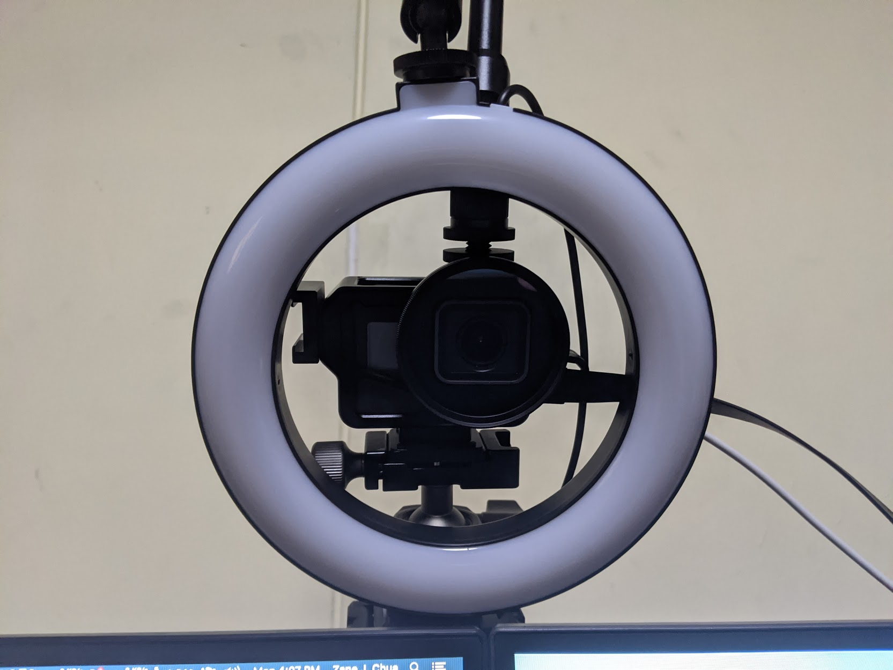
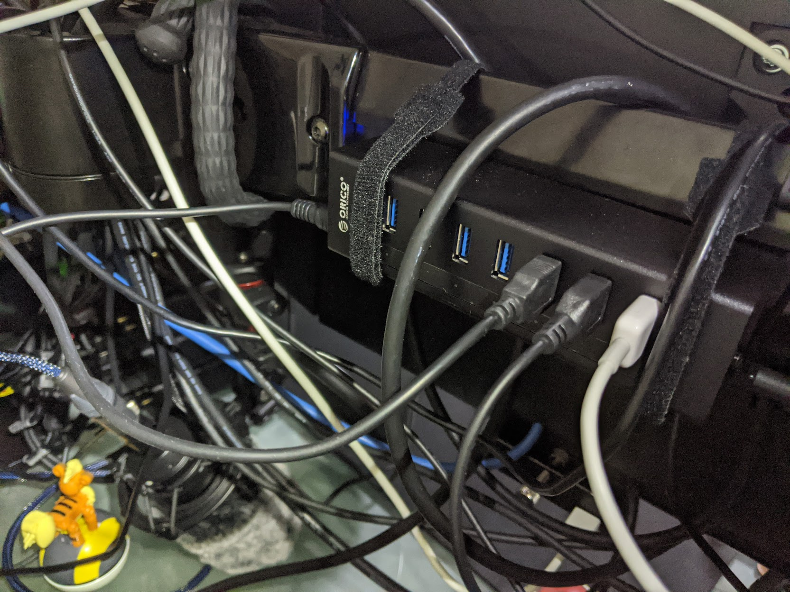
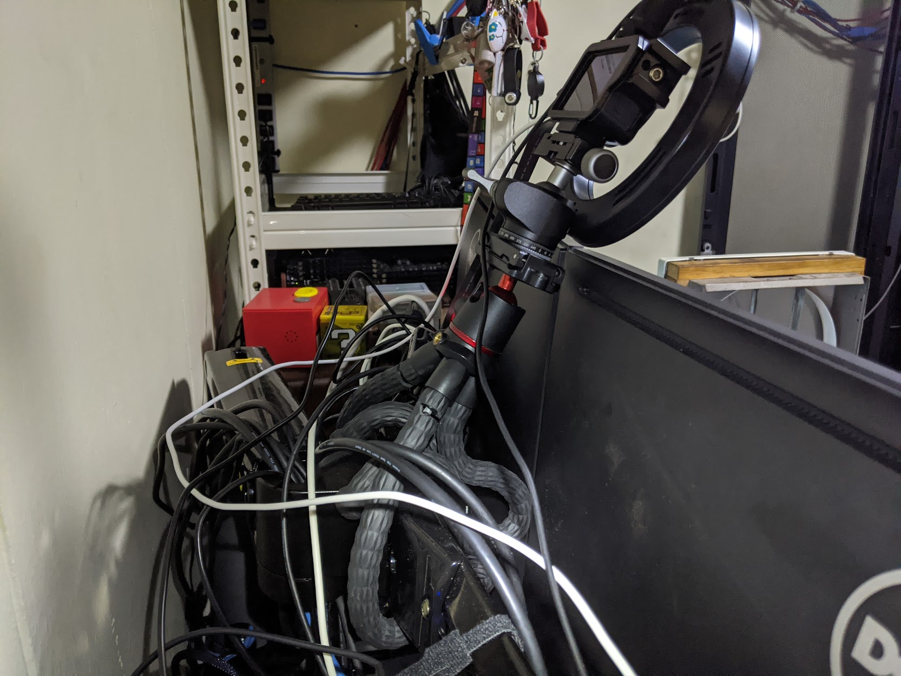
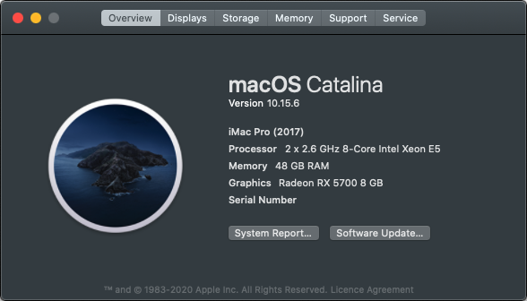
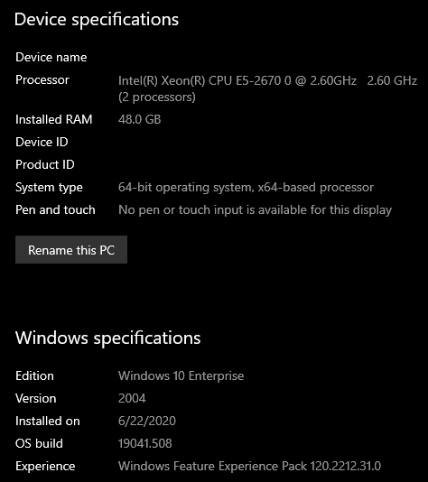
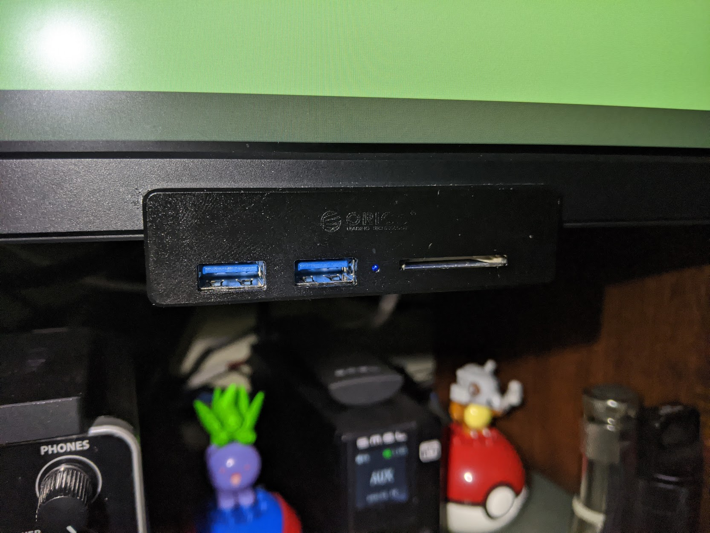
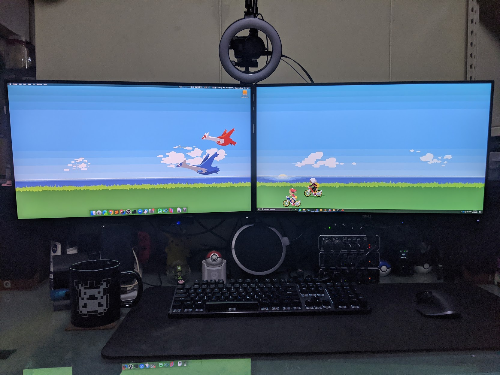

I've been working on this tiny turned big sized project on running both MacOS and Windows on a single workstation at the same time. There were a lot of challenges with this build from various usability issues to issues that I faced with my personal set-up.

Here's a list of requirements that I figured out along the way:
* Single Audio Input/Output for both OSes
* Single Video Input for both OSes
* Convenient access to USB ports for both OSes
* Dedicated GPUs for each OS

## Host Machine

The host OS uses Proxmox 6.2, and the setup is pretty straight forward. Download the iso off the proxmox website, load it up to a usb drive via Rufus and install it. Once you have installed it, you'll be able to connect to proxmox via the web interface. The changes that I made to proxmox was to remove the annoying no subscription message and to enable the public repo for updates.

* Remove proxmox subscription message: [https://gist.github.com/tavinus/08a63e7269e0f70d27b8fb86db596f0d][1]
* Add proxmox public repo for updates: [https://pve.proxmox.com/wiki/Package_Repositories#sysadmin_no_subscription_repo][2]

My host machine has the following hardware specifications:
* CSE: Corsair Air 540
* MOB: Supermicro X9DRi-F
* CPU: 2 x Intel E5-2670 v1 with Noctua NH-U9DX-i4
* MEM: 16 x 8.0 GB Samsung PC3L-12800R DDR3-1600 ECC Memory
* PSU: Thermaltake Toughpower iRGB PLUS 1250W Titanium
* SSD: Intel 520 120GB SSD
* SSD: Intel S3500 800GB SSD
* SSD: Intel Optane 900P 480GB
* USB: IOI Technology U3X4-PCIE4XE111 (4 x FL 1100 USB Controller)
* GPU: Sapphire AMD RX5700
* GPU: Zotac Nvidia GTX 1060 6GB
* NET: Mellanox ConnectX-3 2 x 40Gb QSFP+ MCX354A-QCBT (Flashed to FCBT)

Here's the list of accessories:
* MON: 2 x Dell U2715H + North Bayou F32 Dual Monitor Mount
* KEB: Tecware Phantom Elite + Gateron Greens
* MSE: Logitech MX Master 3
* FAN: 3 x Noctua NF-F12 industrialPPC-3000 PWM
* FAN: 3 x Noctua NF-A14 industrialPPC-3000 PWM
* VID: GoPro Hero 5 Black
* VID: 1 IN / 2 OUT HDMI Splitter
* VID: 2 x USB HDMI Capture (1080@30)
* AUD: 3 x Behringer UMC202HD
* AUD: Rolls MX51s Mini-Mix 2
* CBL: 1/4 TRS Jack to 1/4 TRS Jack
* CBL: 1/4 TRS Jack to 2 x TS 1/4 Jack
* CBL: 2 x (2 x TS 1/4 Jack to 2 x RCA Male)
* CBL: 2 x RCA Male to 3.5mm Jack
* CBL: XLR Female to 2 x XLR Male Splitter
* MIC: Audio-Technica AT2035
* SPK: Q Acoustics 3020i
* AMP: S.M.S.L AD18
* ACC: 2 x Ulanzi MT-11 Octopus Tripod
* ACC: EyeGrab GoPro Hero 5 Case
* ACC: 6" LED USB Ring Light
* ACC: Orico A3H7 7-Port USB 3.0 Hub
* ACC: 2 x Orico MH4PU 2-Port USB 3.0 + SD Card Reader Hub

The hardware above was basically requisitioned along the way as I found more issues to solve and this is probably the exhaustive list. 

### USB

The most annoying part of this entire build was getting USB 3.0 support. The board I am using does not come with USB 3.0 and because I wanted USB 3.0 support, I had to find an add-in card that worked properly with device resets + MacOS. In the end, I could only manage to achieve one of them which was MacOS support. The current card uses a Fresco Logic 1100 Controller and has native MacOS Support. There was another card which I actually preferred due to it having 2 x USB 3.0 headers and would allow me to connect the ports on the front of my case. That card however uses a Renesas uPD720202 and doesn't work well with MacOS. Streaming (Audio + Video) data over the Renesas chipset would not work therfore I had to use the FL1100 card. You can read more about the various cards I tested [here][5]

The U3X4-PCIE4XE111 gives us four FL1100 controllers that can be passed-through to the VMs. I passthrough two FL1100 controllers coupled with one onboard Intel controller that go to MacOS and Windows respectively.

One USB 3.0 port is used by the Dell U2715H's USB hub that has the audio interface and other devices connected to it, while the other is for the Orico MH4PU that's mounted on the bottom of my monitors that allow me to easily connect usb devices to either OS. The Left being MacOS and the right being Windows.

There are some issues mounting the Orico MHP4U to the bottom of the monitor as this monitor isn't flat at the back but, I'll probably just use some 3M VHB tape to solve this. The hub doesn't come in a black variant and therefore I just spray painted mine.

### Audio



The audio setup was basically modelled after the post of [audio hardware for vfio setups][7] by the guys over at The Passthrough Post. The only difference here was that I decided to get the more expensive Behringer UMC202HDs for both VMs as that gave me the benefits of stacking the audio interfaces and have more inputs/outputs. The first interface is used as an input for the microphone which is an Audio-Technica AT2035. I bought an XLR Splitter because the way this interface works is that it splits the first input to the left channel and, the second input to the right channel when using direct monitor. I wanted the audio on both channels and that's where the splitter comes in. 

The Rolls MX51s mixer takes the output from the second and third interface that is connected to both the MacOS and Windows VMs respectively and outputs to the S.M.S.L AD18 via AUX which then outputs the audio from both OSes at the same time.



The microphone set-up involves mounting the microphone to the Ulanzi MT-11 tripod and hanging it upside down from my monitor mount, so it's basically hanging at the bottom. Placed a simple fur cover that takes care of wind (from my fan) and a pop filter hovering on top of it.

### Webcam/Video



The Webcam/Video setup was inspired by the audio setup and when coupled with the use of these cheap [usb hdmi capture devices][8] that have been popping up with "raving" reviews, enables us to accomplish this pretty cheaply sans the GoPro. A USB hdmi capture dongle is each connected to the MacOS and Windows VMs.
 

 
 The GoPro is configured to output the live view through HDMI and is powered via the Orico 7-Port USB Hub. This hub has no other use than to provide power for the components. The output of the GoPro goes to the HDMI splitter and, the splitter is connected to each of the USB hdmi capture dongles. This allows us to have real time video input for both MacOS and Windows.



The GoPro itself is mounted on a Ulanzi MT-11 tripod with the Eyegear Case. I like this case particularly because it gives you the sliding door to ensure your GoPro stays in and allows you to open the side door for the hdmi and power cables. It has two hotshoe mounts which I used to mount a 6" LED USB Light after noticing my video input was a little dark. This case also gives you the ability to screw on any 55mm filter but I haven't had a good experience trying filters that "zoom" in so that the view isn't so wide. I've just resorted to using OBS to do it.

There is a small issue that I faced with the GoPro output automatically changing the configuration by itself. I think this has something to do with me not placing a battery inside the GoPro and trying to use the 2.7k resolution which results in heat and not enough power. I've changed it back to 1080p@30 and hopefully this will resolve that issue altogether.

### Proxmox

For the host, I have the following four files in `/etc/modprobe.d/` that will prepare the system for the MacOS and Windows VMs.
* kvm.conf
* kvm-intel.conf
* pve-blacklist.conf
* vfio-pci.conf

Ignoring certain errors for a clean `dmesg` output

kvm.conf
```bash
options kvm ignore_msrs=1 report_ignored_msrs=0
```

This was made to allow for nested virtualization support, e.g. support for Hyper-V/Docker

kvm-intel.conf
```bash
# Nested VM support (not used by macOS)
options kvm-intel nested=Y
```

Blacklisting the Nvidia and AMD modules resolve issues when the host has issues releasing the cards and passing them through to the VMs

pve-blacklist.conf
```bash
# This file contains a list of modules which are not supported by Proxmox VE 
# nvidiafb see bugreport https://bugzilla.proxmox.com/show_bug.cgi?id=701
blacklist nouveau
blacklist nvidia
blacklist nvidiafb
blacklist snd_hda_codec_hdmi
blacklist snd_hda_intel
blacklist snd_hda_codec
blacklist snd_hda_core
blacklist radeon
blacklist amdgpu
```

Targeting PCI device IDs for binding

vfio-pci.conf
```bash
options vfio-pci ids=1002:67df,1002:aaf0,1002:731f,1002:ab38,10de:1c03,
10de:10f1,8086:2700,8086:1d26,8086:1d2d,8086:1d6b disable_vga=1
```

## MacOS VM



MacOS installation is pretty straight forward as long as you have access to a Mac. I followed Nick Sherlock's guide which you can find [here][3]. The installation process for MacOS is mainly the same as the guide, they should only differ in the modprobe configuration for the host. As for MacOS itself, the only thing I added was `agdpmod=pikera` to the boot options of OpenCore as I'm using an RX 5700.

My MacOS VM has the following specifications:
* CPU: 16 Cores / 2 Sockets
* MEM: 48.0 GB Memory
* SSD: Intel S3500 800GB SSD
* USB: 2 x FL 1100 USB Card
* USB: Onboard Intel USB Controller
* GPU: Sapphire AMD RX5700
* NET: VMXNet3 Network Device
* AUD: Behringer UMC202HD
* VID: USB HDMI Capture (1080@30)

There are still a list of issues with MacOS, some have been resolved but there are some caveats that you just have to live with.

Here's a list of issues that I faced with MacOS:
* Audio Device defaults keep changing (Resolved with [Audio Profile Manager][6] where you can pin the inputs/outputs)
* Barrier (Software KVM) doesn't work sometimes, a reboot usually fixes it.
* You have to login to Windows before MacOS otherwise you won't be able to use the Keyboard/Mouse
* Audio stuttering happens intermittenly. Noticeable when there's a spike in CPU usage
* SMB shares take forever to load and potentially freeze up
* Have to be wary about MacOS Updates
* Reboots require you to reboot the entire host machine

## Windows VM



Installation for Windows is pretty standard, upload the ISO to proxmox and just finish the installation to the NVMe drive. I had some issues with setting the NVMe drive as the default boot order, but you can use the following workaround that I have detailed [here][4]. 

My Windows VM has the following specifications:
* CPU: 24 Cores / 2 Sockets
* MEM: 48.0 GB Memory
* SSD: Intel Optane 900P 480GB
* USB: 2 x FL 1100 USB Card
* USB: Onboard Intel USB Controller
* GPU: Zotac Nvidia GTX 1060 6GB
* NET: VirtIO Network Device
* AUD: Behringer UMC202HD
* VID: USB HDMI Capture (1080@30)
* OPT: Intel C602 Sata SCU

As for Windows, there really isn't much to say. You'll have to install the VirtIO drivers since we want to get full network speed and as much performance as possible. The only issue I have noticed so far is when I first installed the FL 1100 card, my audio interface refused to work. Pro Tip: Don't install the Fresco Logic drivers, use the one that comes with Windows.


## Usage

### Input
Since we have both virtual machines up and running, we want to use a single keyboard + mouse. I've tried Synergy 2, Synergy 3 as I have licenses for those but I ended up with the OpenSource variant [Barrier][9]. You will have to initially plug a keyboard and mouse to the MacOS VM and configure barrier, but once that is done you should be able to share the keyboard and mouse. I have the keyboard and mouse plugged into Windows and shared to MacOS.

### Accessible Ports



I think for most of us, we have the front IO on our case for easy usb access and what not. In this instance, that's where the Orico MHP4U that I mentioned above comes in. This allows you to plug devices into either OS at any point of time and the fact that they are sitting below the screen of the OS should be an easy indicator of which one to plug to in the event you manage to forget which OS is which. 

## Conclusion


All in all, this was a fun side project to work on and make usable. I am sure I'll still be making small improvements here and there but the gist of the information is here. I was wrecking my brains out at how to get all of this working at the start but this should serve as a good summary/build log for my future self when I revisit this topic again. If you've made it this far, thanks for reading! If you've any questions, ping me on twitter [@zanejchua][10] as I still haven't gotten comments set-up on my site.

#### References:
* [https://gist.github.com/tavinus/08a63e7269e0f70d27b8fb86db596f0d][1]
* [https://pve.proxmox.com/wiki/Package_Repositories#sysadmin_no_subscription_repo][2]
* [https://www.nicksherlock.com/2020/04/installing-macos-catalina-on-proxmox-with-opencore/][3]
* [https://forum.proxmox.com/threads/cannot-edit-boot-order-with-nvme-drive.49179/#post-321269][4]
* [https://forums.unraid.net/topic/58843-functional-multi-controller-usb-pci-e-adapter/page/2/?tab=comments#comment-873328][5]
* [https://apps.apple.com/us/app/audio-profile-manager/id1484150558][6]
* [https://passthroughpo.st/audio-hardware-guide-for-vfio-setups/][7]
* [https://twitter.com/ascii211/status/1268631069051453448][8]
* [https://github.com/debauchee/barrier][9]

[1]: https://gist.github.com/tavinus/08a63e7269e0f70d27b8fb86db596f0d
[2]: https://pve.proxmox.com/wiki/Package_Repositories#sysadmin_no_subscription_repo
[3]: https://www.nicksherlock.com/2020/04/installing-macos-catalina-on-proxmox-with-opencore/
[4]: https://forum.proxmox.com/threads/cannot-edit-boot-order-with-nvme-drive.49179/#post-321269
[5]: https://forums.unraid.net/topic/58843-functional-multi-controller-usb-pci-e-adapter/page/2/?tab=comments#comment-873328
[6]: https://apps.apple.com/us/app/audio-profile-manager/id1484150558
[7]: https://passthroughpo.st/audio-hardware-guide-for-vfio-setups/
[8]: https://twitter.com/ascii211/status/1268631069051453448
[9]: https://github.com/debauchee/barrier
[10]: https://twitter.com/zanejchua