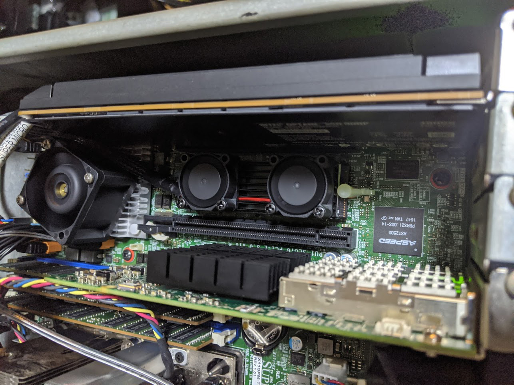

This server build has been going on for a while now... like 2 years from planning to what I consider "complete", and it's mainly because I have a list of objectives that I would've liked to achieved with this particular build. This has had me sourcing the correct parts for the server, and I've also hit some snags along the way. I'll be mentioning some issues that I've faced during this particular build.

List of objectives:
* 2U Form Factor
* Front Facing IO
* ATX PSU
* Not loud like rockets (My fan is louder than the server)
* Air cooled server in a 2U space with decent temps
* Fans shouldn't be producing high-pitch whine
* 10Gbit minimum with redundancy
* Reduce power consumption

## Build

Hardware Specifications:
* OS: ESXi 6.7
* CSE: Generic 2U Case 
* MOB: Supermicro X11SPM-TPF
* CPU: Intel Xeon Platinum ES 8160 QL1K + Supermicro 2U Active Heatsink (SNK-P0068APS4)
* MEM: 6 x 32.0 GB Samsung PC4-17000R DDR4-2133 ECC Memory
* PSU: FSP Twins ATX 1+1 Redundant 500W Gold
* SSD: WD Black SN700 1TB NVMe SSD
* SSD: 12 x WD Blue 1TB SATA SSD
* SSD: Intel Optane 900P 480GB
* NET: Mellanox ConnectX-3 2 x 40Gb QSFP+ MCX354A-QCBT (Flashed to FCBT)
* FAN: 1 x San Ace 60mm 12v 2.7A PWM (9HV0612P1J001)
* FAN: 5 x Delta 40mm 12v 0.81A PWM (FFB0412UHN-TD34)
* FAN: 2 x Nidec UltraFlo 80mm 12v 0.6A PWM (V80E12BHA5-57)
* ACC: Dual Fan M.2 2280 SSD Cooler

## Services

Here's what I run on the server itself:
* OPNsense
* VMWare vCenter Server Appliance
* Nginx Web Server
* APC PowerChute Network Shutdown
* Plex
* FreeNAS
* Development Server
* GitLab Runners
* FreePBX

## Build Process
This built was planned because at that point of time, the 4U server that I was using was really hot and honestly I didn't need that many hard drives to be running all the time. The 4U Server was an old server with dual Xeon E5-2670 v1's. So it does really produce a decent amount of heat and in my climate, it's already hot enough. I sit in the same room as my server rack does and the room itself doesn't have air conditioning. The ambient temperatures here in Singapore are 28-ish Celsius (82F for the old people) and I ain't a big fan of heat.

### OS
When I initially installed everything and decided to migrate the VMs over, I was hitting an issue where the ESXi Datastore would just randomly drop out. Turns out other people were experiencing the same issue and the summary of it was basically the NVVMe drive was getting too hot and just saying `nope` and dropping out of the OS. Only a reboot would redetect the drive and it'll eventually drop out again. Putting a heatsink and fans on the NVMe drive did resolve this issue. Haven't had it drop out since.

### Case
Did I mention this case gave me everything I wanted out of the box? Of course I didn't because it didn't. There was a weird 2.5" hard drive cage in the case that I found useless so I threw it out. Never figured out a way to get the 6-32 UNC posts out of the case so I just left them in there. I barely managed to squeeze twelve 2.5" SSDs in there. 

I had to... crimp my own USB header cable because all the header cables that are available in the market are so freaking stiff, including the one that came with the case.

### Motherboard
The motherboard itself runs pretty well. Except that the PCH temperature affects how the fan spins up and down. Before adding a 40mm fan on top of the PCH heatsink, the temps were hovering around 70C. Now they are closer to 55C.

Certain fans don't play well with Supermicro's fan curve, some fans made a ton of whining noise especially at low pwm speeds and it gets really irritating to me. I think there is a study somewhere that basically we humans perceive low pitched hums to be softer than they really are. Well at least to me it does. Other fans would cause the board to spin all fans up as the fan would drop out due to the voltage.

### CPU
I have no problems with the ES CPU except the ES CPU does prevent you from upgrading the bios on the motherboard to anything about v2.1 if I'm not mistaken. But hey, if it works, it works. You don't really need to upgrade the bios if nothing is broken. Who needs security patches that decrease performance in a homelab environment. 🤔

### Memory
Since the build started in late 2018, a lot changed since then and now. I unfortunately bought memory while the prices were twice the price than they are now. 😭

### PSU 
The PSU itself works great but there was a bit of modifying I had to do to the case so that I could pull both modular units out. Just some filing for one corner of the PSU for about 10minutes.

The other thing that bothered me were the fans that were installed in the modules. They should be really good fans but they were just too noisy. They were replaced with the same Delta 40mm fans that I am using for the server itself and they are much quieter now. The connectors on the main board were using the 4-pin VGA fan connector and I didn't want to cut the normal 4-pin fan connectors off so I bought some adapters from AliExpress.

Generally I don't recommend touching the PSU but in this instance I have a ton of air being pushed through them so it should be fine.

I am using a few molex to sata power extensions for the SSDs as there weren't enough, just remember to not use the molded sata ones.

### Network
Initially, an Mellanox ConnectX-2 10Gb network card was added into the server and used as the WAN port. However, I did recent upgrades to the switches in my lab and WAN is still limited to 1Gbps but LAN is being backed by 40Gbps now. 

We still need to use a SFP+ adapter and thankyfully Mellanox makes the MAM1Q00A-QSA-SP QSFP+ to SFP+ adapters that allow you to use your SFP+ adapters in QSFP+ slots. 

### Fans
The build itself went pretty well and I think the most challenging part of this build was finding the correct set of fans. The build came with holes for 2 x 80mm fans at the rear but I think that wasn't enough. I bought a hole drill and drilled a 60mm hole to add a 60mm fan. After taking some measurements for the front, I determined that I could fit four 40mm fans.

The motherboard didn't play well at all with the 60mm fan as mentioned above, and I had to go through quite a number of them (I'll post my fan "collection" at the end of this section). Eventually I manage to find the curent San Ace fan that fits right into my expectations. I had to crimp the fan myself as it didn't come with the connector.

Initially I had configured the fans to exhaust heat out the front as that was the way the cpu cooler was recommended to be installed. Except that my case is front IO.. and that would mean that the heat would be coming out from the front while the rest of my server appliances would be drawing cool air from the front. Took me awhile to realise this but I switched from front exhaust to rear exhaust. Temps improved by 10C with just this change.

The fans were all mounted with anti-vibration mounts and it was a pain trying to find thin anti-vibration mounts for the 40mm fans as they were so thick and the mounting holes were not the open air variant. Eventually I did find some but even then, the mounts would break after a while. Possibly due to the stress and just the low quality of them. I switched to using long 35mm screws + washers + nuts and that's definitely not going to "break".

## Summary
For the most part, I didn't work out all the issues at once. It was more of an iterative process to figure it all out over the course of using the server. It's been pretty much running as my day-to-day for the past year or so.

I definitely went over-budget with this server and don't plan to do another build like this anytime soon. The one thing I would do better is to probably try to spec out for NVMe drives the next time as NVMe drives have came down in price. That way I'll definitely be able to saturate 10Gb speeds. I will talk more about the services that I listed in another post as there's quite a ton to explain for the services themselves. Perhaps I'll also go into network setup and/or physical setup.

I pretty much just stuffed the SSDs in that corner. 😂 Hey it's HomeLab.

