My three most recent builds were using ASRock Rack server boards. The two boards `X470D4U` and the `ROMED8-2T` use the `TPM2-S/INFINEON` module.
The one that is different is the `X570D4I-2T` which uses the `TPM2-SLI` module. I looked around and couldn't find a place to buy the `TPM2-SLI` module, so I decided to make my own. Since I was making one, I figured I would make the modules for the other boards too even though they were available for purchase.

I run Windows 11 on the `X470D4U` and ESXi on the other two. ESXi does not support the fTPM implementation for host attestation, hence the need for a hardware TPM module instead.

This proved to be beneficial for me on the `X470D4U` for two reasons:

- The latest bios available contains the AMD AGESA of 1.2.0.0 which has the [stuttering issue](<https://www.guru3d.com/news-story/amd-fixes-stuttering-issues-in-windows-11-and-windows-10-(related-to-ftpm).html>) when the fTPM is utilized on machines running Windows 11
- The GPU is inserted in the last slot of the board. The `TPM2-S` module is a vertical module and this would prevent my GPU from being seated into the board itself

# Journey

I started off with scouring the interwebs for someone who has done this before and `TheJeffChen` over at the LTT forum posted about one he made for his ASUS board and was kind enough to post his completed board along with the components needed.

Dugged around more trying to understand the pin outs and those were detailed in the motherboard manual of my boards.

> '\*' denotes pin 1

## 14-pin Module (TPM2-SLI)

The 14-pin module uses the following pinouts:

| DESC  |     |     | DESC   |
| ----- | --- | --- | ------ |
| \*33M | ◯   | ◯   | GND    |
| RST   | ◯   | ◯   | LFRAME |
| LAD0  | ◯   | ◯   | LAD1   |
| LAD2  | ◯   | ◯   | LAD3   |
| GND   | ◯   | ◯   | GND    |
| +3V   | ◯   | ◯   | +3V    |
| NC    | ◯   | ◯   | +3V    |

That's fine because when we refer to the Infineon Datasheet for `SLB9665` TPM module we see that all these pins are available. It's simply mapping the pins from the module to the header pins that will be plugged into your board. They even provide a sample schematic on how the chip is typically used.

## 18-pin Module (TPM2-S/INFINEON)

The 18-pin module uses the following pinouts:

| DESC          |     |     | DESC          |
| ------------- | --- | --- | ------------- |
| F_CLKRUN#     | ◯   | ◯   | GND           |
| SERIRQ#       | ◯   | ◯   | +3VSB         |
| S_PWRDWN#     | ◯   | ◯   | NC            |
| GND           | ◯   | ◯   | LAD0_L        |
| LAD2_L        | ◯   | ◯   | +3V           |
| LAD1_L        | ◯   | ◯   | LAD3_L        |
| SMB_DATA_MAIN | ◯   | ◯   | TPM_RST#      |
| SMB_CLK_MAIN  | ◯   | ◯   | LFRAME#\_L    |
| GND           | ◯   | ◯   | \*CLK_33M_TPM |

Now this pinout is confusing. The `SLB9665` only has 10 pins that match the pins in the above pinout configuration. Now this is awkward. Why do we have 4 additional pins that we have nowhere to hook up to? Took a little searching but this [article](https://serverfault.com/questions/927761/trusted-platform-module-tpm-versions-1-2-vs-2-0-and-header-number-of-pins) was the gold mine for me in understanding that this 18-pin configuration was also used for TPM 1.2. The additional pins were simply a left over from the chips that support TPM 1.2. These are pretty modern boards so I'm not sure why ASRock decided to use the 18-pin configuration instead of the newer 14-pin configuration.

TPM 2.0 pinouts:

| DESC      |     |     | DESC          |
| --------- | --- | --- | ------------- |
| F_CLKRUN# | ◯   | ◯   | GND           |
| SERIRQ#   | ◯   | ◯   | NC            |
| NC        | ◯   | ◯   | NC            |
| GND       | ◯   | ◯   | LAD0_L        |
| LAD2_L    | ◯   | ◯   | +3V           |
| LAD1_L    | ◯   | ◯   | LAD3_L        |
| NC        | ◯   | ◯   | TPM_RST#      |
| NC        | ◯   | ◯   | LFRAME#\_L    |
| GND       | ◯   | ◯   | \*CLK_33M_TPM |

# Solve

So now that I have my answers, I began designing the schematics per the datasheet and hooking them up for both the 14 and 18 pin configurations.

Components Required:

- PCB (Fabbed mine at JLCPCB)
- Infineon `SLB9665TT20` TPM Chip
- 1 x 2x7 and 2x9 2.0mm pin header
- 5 x 100nF SMD capacitors
- 2 x 10K 0603 SMD resistor

I had issues with finding the 2x9 pin headers, but they had 2x10 headers available, so I just bought that, snipped off 1 column of pins and sanded it down to get it smooth.

If you live in Singapore and want to try this out for yourself, I can ship you some boards of either variation as long as you pay for shipping or self collect.

If you're outside of Singapore, fabricating it yourself may be cheaper? But hey if you want to pay for shipping from Singapore, I'll oblige too.

I've included the gerber files in the repo:

https://github.com/zanechua/asrock-tpm

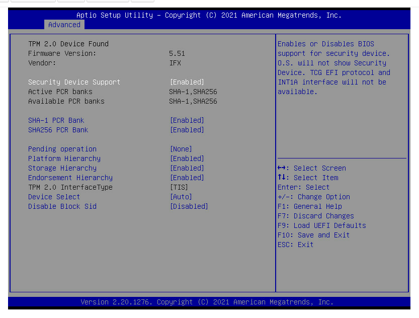

## 14-pin Module (TPM2-SLI)

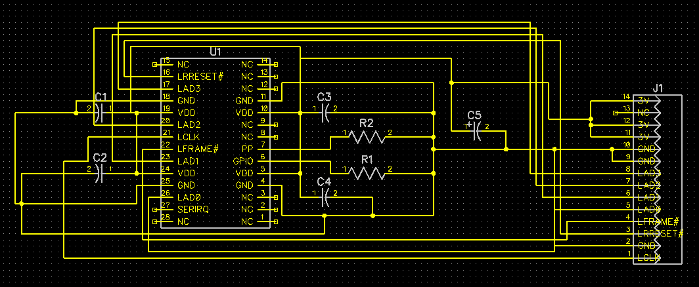
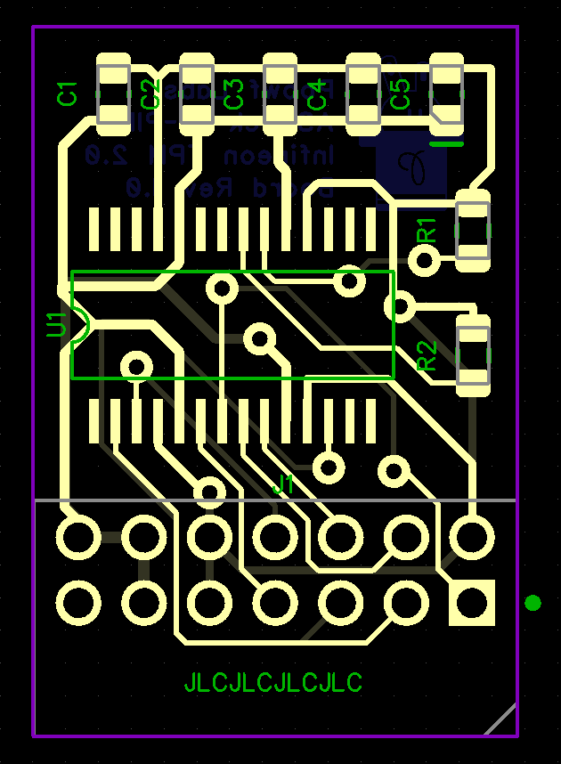
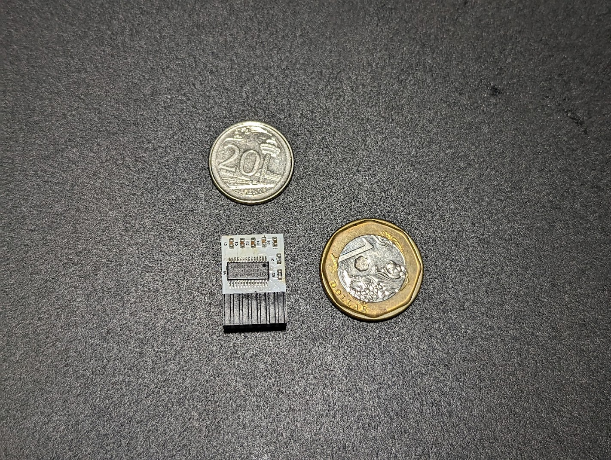
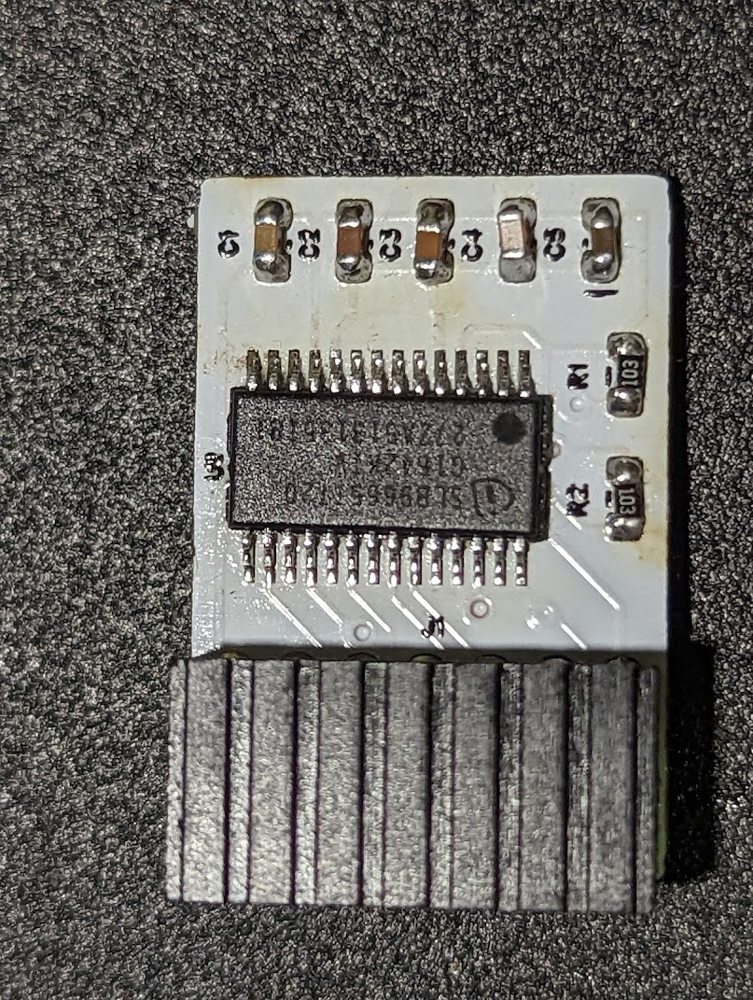
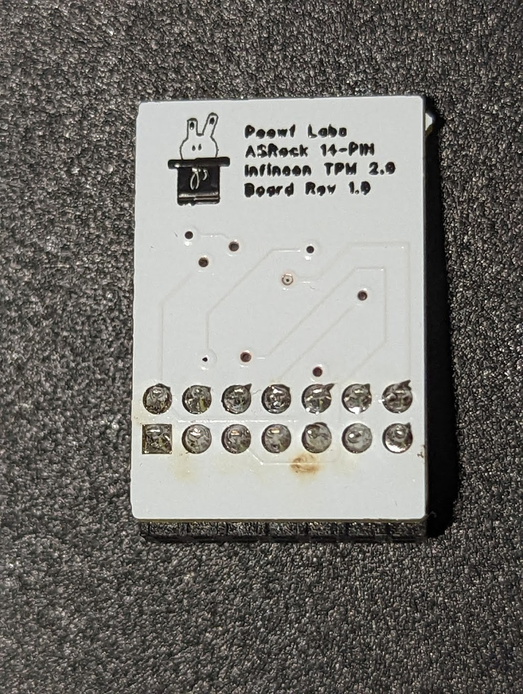

## 18-pin Module (TPM2-S/INFINEON)

This post was delayed because of the 18-pin module as it was not working when I tested it. I only realized that ASRock had the pinouts reversed in their manuals and once I flipped the fabricated board over, it worked instantly. So now I can push this post up.

The other issue that I faced was that I needed to replace the pin headers with a right angle variant due to the GPU being above. My mistake turned out to be correct and the board is now facing downwards (exactly how I wanted it).

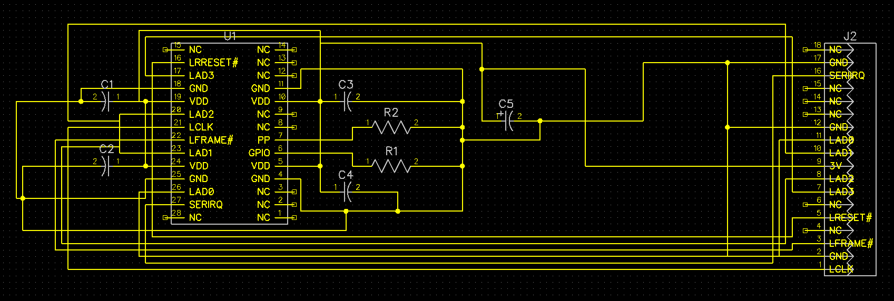
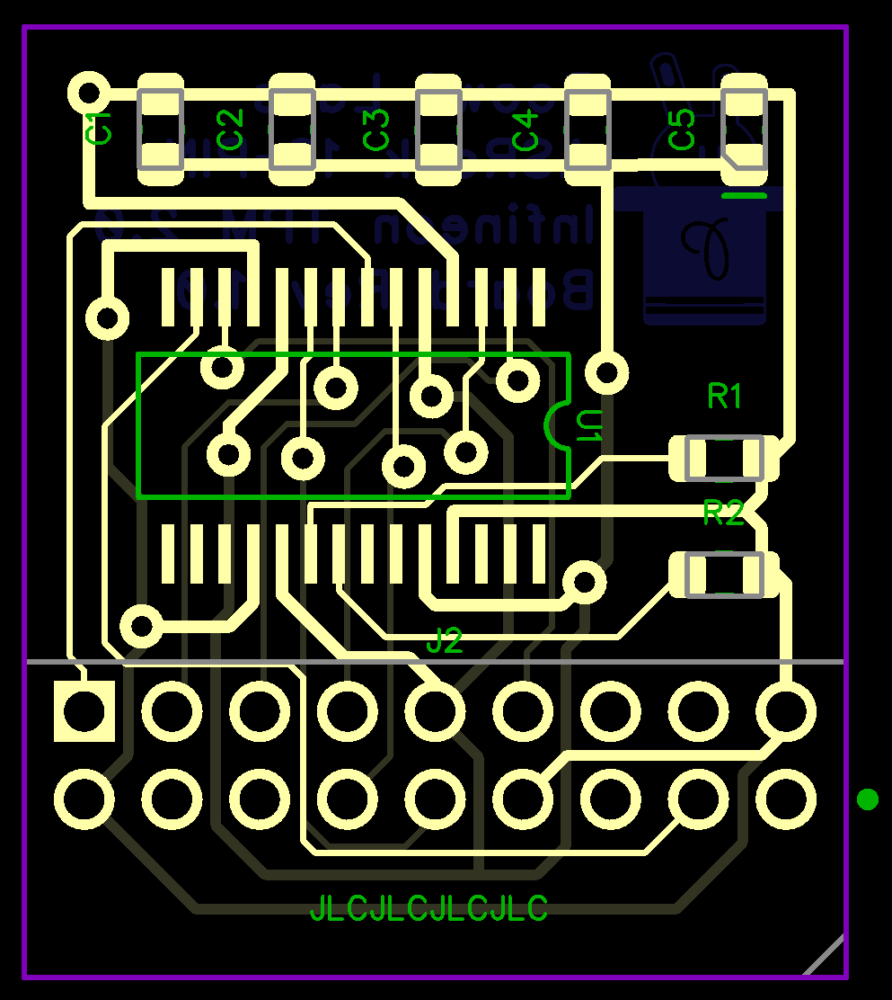
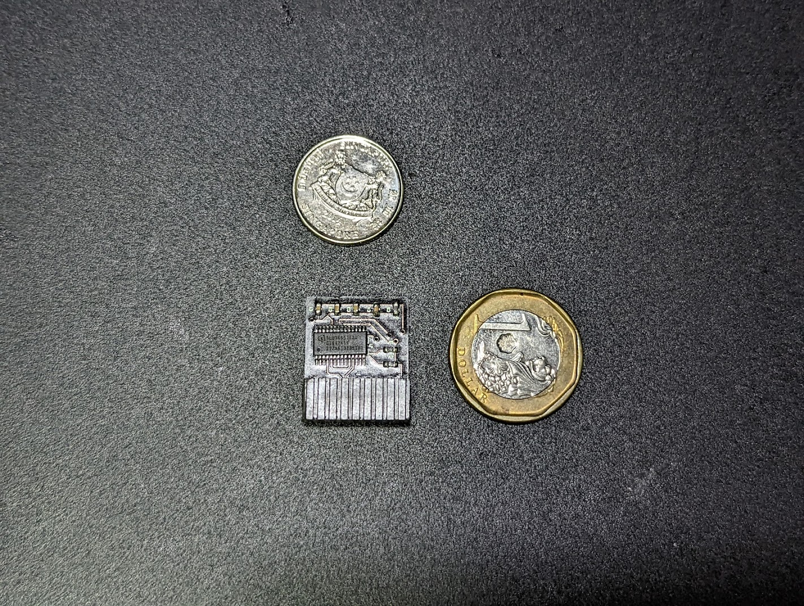
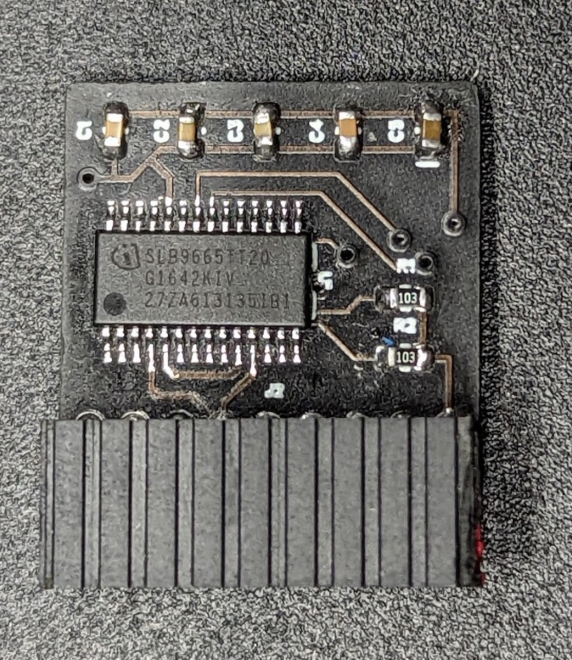
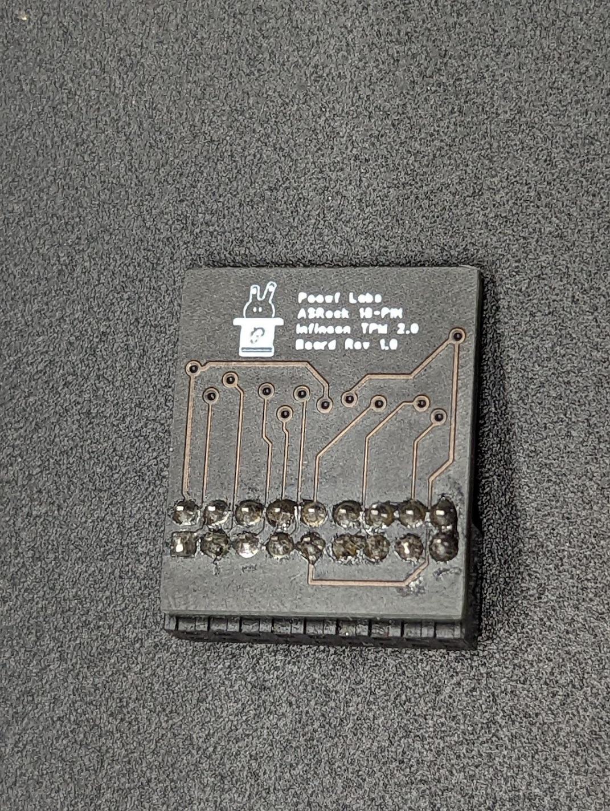
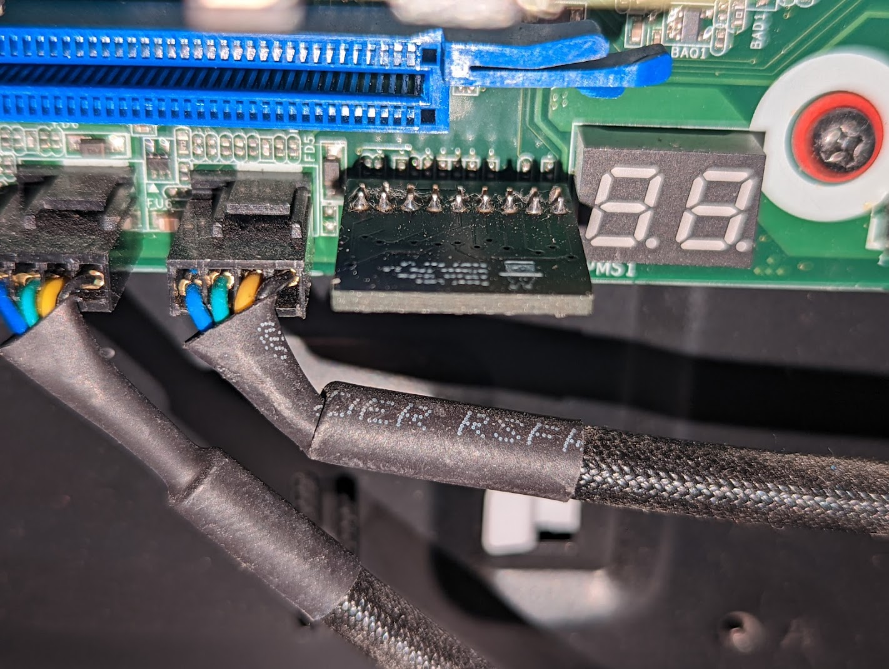
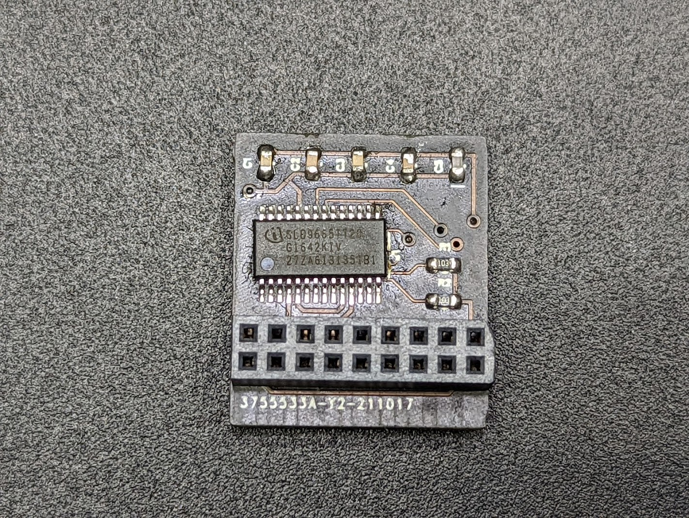
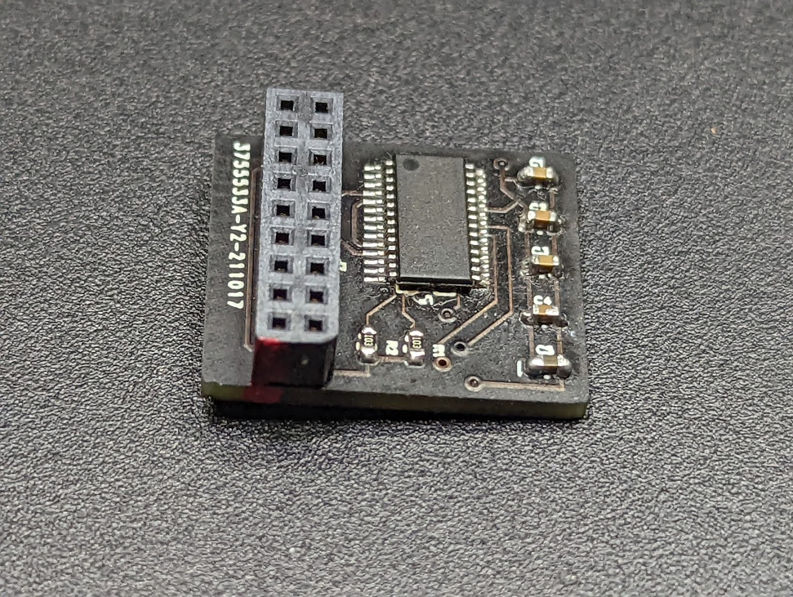
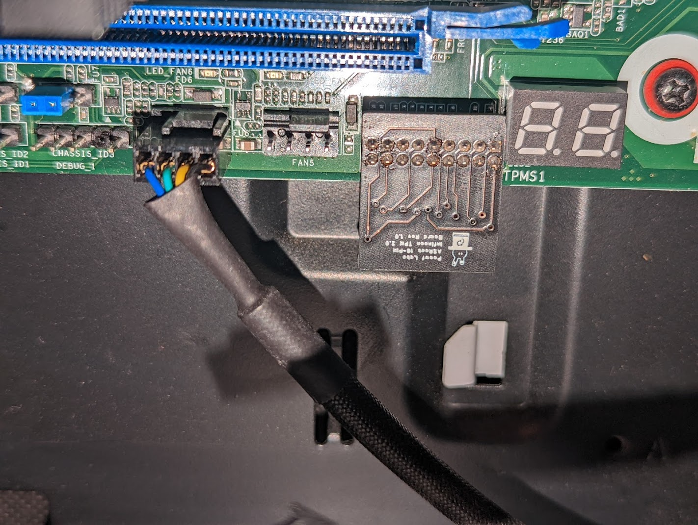

## Upgrading TPM firmware

Depending on where you buy your TPM chips from, you may need to update the firmware on it. Use the following guides to upgrade the TPM firmware:

- Windows: https://silvenga.com/upgrading-firmware-infineon-tpm/
- Linux: https://qzhou.dev/updating-a-vulnerable-tpm

> Firmware versions ending with '.2' seem to indicate an FIPS 140-2 compliant chip

#### References

- [https://en.wikipedia.org/wiki/Low_Pin_Count][1]
- [https://www.asrockrack.com/general/productdetail.asp?Model=X570D4I-2T#TPM][2]
- [https://www.asrockrack.com/general/productdetail.asp?Model=X470D4U#TPM][3]
- [https://www.asrockrack.com/general/productdetail.asp?Model=ROMED8-2T#TPM][4]
- [https://serverfault.com/questions/927761/trusted-platform-module-tpm-versions-1-2-vs-2-0-and-header-number-of-pins][5]
- [https://linustechtips.com/topic/1363161-my-diy-asus-14-1-pin-tpm-m-r20-module/][6]
- [https://site.gothtech.co.uk/articles/gigabyte-motherboard-tpm-compatibity][7]
- [https://ottelo.jimdofree.com/tpm/][8]
- [https://www.infineon.com/dgdl/Infineon-data-sheet-SLB9665_2.0_Rev1.2-DS-v01_02-EN.pdf?fileId=5546d462689a790c016929d1d3054feb][9]
- [https://munetoh.hatenadiary.org/entry/20161020][10]
- [https://github.com/subutai-io/blockchain-router/issues/13][11]
- [https://superuser.com/questions/925097/do-tpm-modules-only-work-for-motherboards-of-the-same-vendor][12]
- [https://content.etilize.com/Manufacturer-Brochure/1026638573.pdf][13]
- [https://rog.asus.com/forum/showthread.php?96727-Asus-Infineon-TPM-firmware-update/page12#post84969][14]
- [https://silvenga.com/upgrading-firmware-infineon-tpm/][15]

[1]: https://en.wikipedia.org/wiki/Low_Pin_Count
[2]: https://www.asrockrack.com/general/productdetail.asp?Model=X570D4I-2T#TPM
[3]: https://www.asrockrack.com/general/productdetail.asp?Model=X470D4U#TPM
[4]: https://www.asrockrack.com/general/productdetail.asp?Model=ROMED8-2T#TPM
[5]: https://serverfault.com/questions/927761/trusted-platform-module-tpm-versions-1-2-vs-2-0-and-header-number-of-pins
[6]: https://linustechtips.com/topic/1363161-my-diy-asus-14-1-pin-tpm-m-r20-module/
[7]: https://site.gothtech.co.uk/articles/gigabyte-motherboard-tpm-compatibity
[8]: https://ottelo.jimdofree.com/tpm/
[9]: https://www.infineon.com/dgdl/Infineon-data-sheet-SLB9665_2.0_Rev1.2-DS-v01_02-EN.pdf?fileId=5546d462689a790c016929d1d3054feb
[10]: https://munetoh.hatenadiary.org/entry/20161020
[11]: https://github.com/subutai-io/blockchain-router/issues/13
[12]: https://superuser.com/questions/925097/do-tpm-modules-only-work-for-motherboards-of-the-same-vendor
[13]: https://content.etilize.com/Manufacturer-Brochure/1026638573.pdf
[14]: https://rog.asus.com/forum/showthread.php?96727-Asus-Infineon-TPM-firmware-update/page12#post84969
[15]: https://silvenga.com/upgrading-firmware-infineon-tpm/
