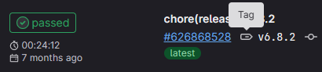
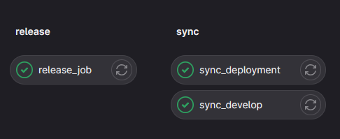
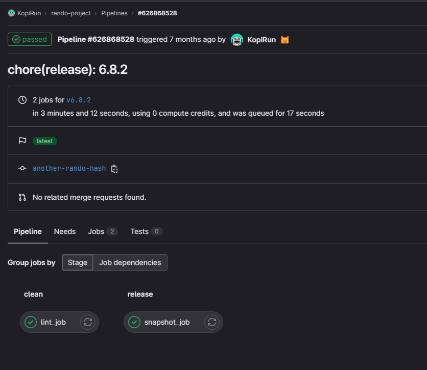
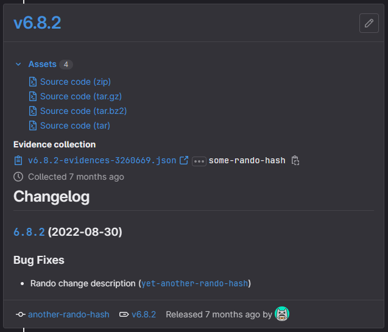

Versioning and releasing an application can be a time-consuming and complex process, especially when it involves tasks like determining the correct version to bump, adding appropriate tags, syncing the version back to different branches, and more.

# Journey

In a small team, you tend to start automating a lot of work so that you can get more free time back and basically make a computer do the work for you. However, that also means that you need to provide relevant information to determine what version to bump to. We did not have a versioning strategy at the start, but now we're using a combination of packages to help us do so.

For example, if you added a breaking change, is your application following semantic versioning? If so you should bump the major version. How about when you should bump a minor or patch version or what if you're not on semantic versioning, what would your versioning strategy be then?

The process we had initially was to make use of [conventional commits](https://www.conventionalcommits.org/) coupled together with [standard-version](https://github.com/conventional-changelog/standard-version) to bump up our project version. That worked well, but it was a bit lacking as we had to run the release command everytime, made sure we synced the changes back to the develop (Admittedly some of us forgot to do this) branch and create a release for this in GitLab. When you're doing this many rapid releases multiple times in a week, this whole process can be quite a chore to do.

Automation to the rescue! The other challenge that we faced was how do we ensure our engineers adhere to the conventional commit standard? We combined [commitizen](https://github.com/commitizen/cz-cli) which is essentially a command line helper tool to create a commit along with [cz-conventional-changelog](https://github.com/commitizen/cz-conventional-changelog).

However, that only enforces the convention if they actually use the `cz` command. How would we enforce it if they use the `git` command directly? With a combination of [husky](https://github.com/typicode/husky) , [@commitlint/cli](https://github.com/conventional-changelog/commitlint) and [@commitlint/config-conventional](https://github.com/conventional-changelog/commitlint). `husky` is a popular package that allows you to execute code in a certain lifecycle stage in `git`. It leverages `git` hooks and bootstraps the necessary hooks when someone sets up the project repository in their environment. The packages under the `@commitlint` umbrella help us enforce that the conventional commit standard is being adhered to.

Let's get onto the actual code now that we've talked about the problem statement.

# Solve

At this point, I am going to assume that you already have a basic CI/CD pipeline within GitLab itself, so let's do some abstraction of the jobs so that we don't have to maintain such a large `.gitlab-ci.yml` file.

## Setting up the pipeline templates

The following is a `.base.yml` that can act as a base template for all your repositories, let's not make it more complicated now and assume that this will be stored in the same repository as your code.

I've shown this code before in another [post](/blog/lint-and-format-code-node-gitlab-pipelines) about linting and formatting code in a GitLab pipeline.

The following code sets up the `ssh` environment in the job to make sure that it is able to connect over `ssh` to push changes. Running the `ssh` command on your local machine when you're connecting to a host for the first time would result in you having to "verify" if you are connecting to the correct host.

This also assumes that you have a bot account or equivalent and is using an SSH key stored in a variable named `CI_SSH_PRIVATE_KEY` at a group or project level. There are other ways around it like using project or group access tokens.

```yaml:title=/templates/.base.yml
.git_setup:
  before_script:
    ##
    ## Install ssh-agent if not already installed, it is required by Docker.
    ## (change apt-get to yum if you use an RPM-based image)
    ##
    - 'which ssh-agent || ( apk --update add git openssh-client )'

    ##
    ## Run ssh-agent (inside the build environment)
    ##
    - eval "$(ssh-agent -s)"

    ##
    ## Add the SSH key stored in SSH_PRIVATE_KEY variable to the agent store
    ## We're using tr to fix line endings which makes ed25519 keys work
    ## without extra base64 encoding.
    ## https://gitlab.com/gitlab-examples/ssh-private-key/issues/1#note_48526556
    ##
    - echo "$CI_SSH_PRIVATE_KEY" | tr -d '\r' | ssh-add -

    ##
    ## Create the SSH directory and give it the right permissions
    ##
    - mkdir -p ~/.ssh
    - chmod 700 ~/.ssh

    ##
    ## Alternatively, use ssh-keyscan to scan the keys of your private server.
    ## Replace example.com with your private server's domain name. Repeat that
    ## command if you have more than one server to connect to.
    ##
    - touch ~/.ssh/known_hosts
    - ssh-keyscan $CI_SERVER_HOST >> ~/.ssh/known_hosts
    - chmod 644 ~/.ssh/known_hosts

    ##
    ## Optionally, if you will be using any Git commands, set the user name and
    ## and email.
    ##
    - git config --global user.email "bot@example.com"
    - git config --global user.name "Magical CI Bot"
```

Here's the release job, the `script` section does the following:

1. Configures the remote and pulls the current commit branch
2. Sets the current commit message as a variable `SUBJECT_COMMIT_MESSAGE`
3. Sets the default merge commit message format as a variable `MERGE_COMMIT_MESSAGE` for the trigger and target branches
4. Checks if the `SUBJECT_COMMIT_MESSAGE` variable matches the `MERGE_COMMIT_MESSAGE` variable
5. If it doesn't, it'll simply exit the job cleanly
6. Otherwise, it will install all packages required for the release command
7. Release command is executed which results in a new commit being added to the HEAD
8. We push the commit to the current branch we're on
9. We set the `SKIP_SYNC_STAGE` variable so that the sync job runs
10. The artifacts will pass the variables that have been stored in `build.env` to another job that depends on this job

```yaml:title=/templates/release/.base.yml
include:
  - local: '/templates/.base.yml'

release_job:
  stage: release
  cache:
    - key:
        files:
          - yarn.lock
      paths:
        - node_modules/
        - .yarn/
      policy: pull
  before_script:
    - !reference [.git_setup, before_script]
  script:
    - git remote set-url origin git@$CI_SERVER_HOST:$CI_PROJECT_PATH.git
    - git fetch
    - git checkout -B $CI_COMMIT_BRANCH
    - SUBJECT_COMMIT_MESSAGE=$(git log -1 --pretty=%s)
    - echo $SUBJECT_COMMIT_MESSAGE
    - MERGE_COMMIT_MESSAGE="Merge branch '$RELEASE_TRIGGER_BRANCH' into '$RELEASE_TARGET_BRANCH'"
    - |
      if [ "$SUBJECT_COMMIT_MESSAGE" != "$MERGE_COMMIT_MESSAGE" ] ; then
          echo "Release is not required. Skipping this job!"
          echo "SKIP_SYNC_STAGE=true" > build.env
          echo "CI_JOB_SKIP_EXIT_CODE=20" > build.env
          exit ${CI_JOB_SKIP_EXIT_CODE:-0}
      fi
    - yarn install --frozen-lockfile --prefer-offline --cache-folder .yarn
    - echo "Running release"
    - yarn release || true
    - git push --follow-tags -u origin $CI_COMMIT_BRANCH
    - echo "SKIP_SYNC_STAGE=false" > build.env # Run sync stage
    - echo "CI_JOB_SKIP_EXIT_CODE=20" >> build.env # Arbitrary exit code so that future jobs fail and don't waste runner resources
  artifacts:
    reports:
      dotenv: build.env
```

Here's the snasphot job, which basically just leverages on the `release-cli` image provided by GitLab to create a release in your project.

It uses the `CI_COMMIT_TAG` variable as the name and tag for the project coupled with the `CHANGELOG-LATEST.md` for the release description. This job will only run on a `tag` pipeline.

You can identify a particular type of pipeline by looking at the `Pipelines` section of your project and looking out for the symbol beside the sha hash or tag.

A tag pipeline will look like the following:



```yaml:title=/templates/release/.snapshot.yml
snapshot_job:
  stage: release
  image: registry.gitlab.com/gitlab-org/release-cli:latest
  rules:
    - if: $CI_COMMIT_TAG # Run this job when a tag is created
  script:
    - echo "Creating release for $CI_PROJECT_NAME on $CI_SERVER_HOST"
  needs:
    - job: lint_job
      artifacts: true
  release:
    name: $CI_COMMIT_TAG
    tag_name: $CI_COMMIT_TAG
    description: './CHANGELOG-LATEST.md'
```

Here's the sync job and I know it's a bit pointless for the job to be running only for it to check an external variable to control the pipeline execution, however there is no other way to dynamically control job executions based on a previous job's output at the moment due to the deterministic nature of GitLab which generates out the schema or the proper term being a DAG (Directed Acyclic Graph) of the pipeline before executing it.

The `script` section does the following:

1. It checks if the `SKIP_SYNC_STAGE` is `true` and exits cleanly if so
2. Otherwise, it will setup the remote and fetch all the commits
3. The `SYNC_TARGET_BRANCH` will be checked out
4. We will reset hard to the `CI_COMMIT_BRANCH`
5. We will push the changes to the `SYNC_TARGET_BRANCH`

```yaml:title=/templates/sync/.base.yml
include:
  - local: '/templates/.base.yml'

.sync_job:
  stage: sync
  cache: {}
  before_script:
    - !reference [.git_setup, before_script]
  script:
    - echo "Sync Stage"
    - |
      if [ "SKIP_SYNC_STAGE" == "true" ] ; then
          echo "Skipping stage due to variable"
          exit ${CI_JOB_SKIP_EXIT_CODE:-0}
      fi
    - git remote set-url origin git@$CI_SERVER_HOST:$CI_PROJECT_PATH.git
    - git fetch
    - git checkout -B $SYNC_TARGET_BRANCH
    - git reset --hard origin/$CI_COMMIT_BRANCH
    - git push -u origin $SYNC_TARGET_BRANCH
```

## Project modifications

We'll need to make some modifications to your project so that it supports the various packages that I've listed above.

> You can make these changes for projects in any language to enable the ability to do so. But my post does favour Node based applications, you will have to set up some additional configuration to target the files that contain the versioning for that framework or language

Let's install the packages either via `yarn` or `npm`, I will be using `yarn` in all the subsequent examples so please modify as needed.

```bash:title=terminal
yarn add --dev husky @commitlint/cli @commitlint/config-conventional standard-version cz-conventional-changelog rexreplace
```

or

```bash:title=terminal
npm install --dev husky @commitlint/cli @commitlint/config-conventional standard-version cz-conventional-changelog rexreplace
```

Follow the instructions in the documentation of the various packages on how to set them up. I will not go through what each of these modifications do as the functionalities should be well documented in the source repositories themselves.

The only one addition is the `changelog:latest` script that leverages on the `rexreplace` package. This extracts out the latest release information from the `CHANGELOG.md` file to be utilized by the snapshot job as the release description on GitLab.

In summary, you should have the following snippets of code present in these files:

```json:title=package.json
...
  "scripts": {
    ...
    "release": "standard-version",
    "prepare": "husky install",
    "changelog:latest": "rexreplace \"^.*?#+\\s\\[.*?\\n.*?(?=\\s*#+\\s\\[)\" \"_\" -s -M -G -m -o \"CHANGELOG.md\" > CHANGELOG-LATEST.md"
  },
  "config": {
    "commitizen": {
      "path": "./node_modules/cz-conventional-changelog"
    }
  }
```

```json:title=.commitlintrc.json
{
  "extends": ["@commitlint/config-conventional"]
}
```

```json:title=.versionrc.json
{
  "header": "# Changelog\n",
  "types": [
    {"type": "feat", "section": "Features"},
    {"type": "fix", "section": "Bug Fixes"},
    {"type": "chore", "section": "Maintenance"},
    {"type": "docs", "hidden": true},
    {"type": "style", "hidden": true},
    {"type": "refactor", "hidden": true},
    {"type": "perf", "hidden": true},
    {"type": "test", "hidden": true}
  ]
}
```

```bash:title=.husky/commit-msg
#!/bin/sh
. "$(dirname "$0")/_/husky.sh"

yarn commitlint --edit ${1}
```

## Putting it all together

So now that we've got all the templates and project modifications sorted, let's build the actual `.gitlab-ci.yml`.

In the `.gitlab-ci.yml` file below, I am doing the following:

1. Including all the template files that I have defined above
2. Defining a `clean`, `release` and `sync` stage in addition to the rest of the stages that have been previously defined
3. Define a `lint_job` that runs only on a tag pipeline that generates out the latest changelog for the `snapshot_job`
4. Define a `release_job` that only runs on the `master` branch and when the commit message starts with `Merge branch`, the `RELEASE_TRIGGER_BRANCH` and `RELEASE_TARGET_BRANCH` variables makes sure that the direction of merge is from trigger to the target
5. Define a `sync_develop` job that only runs on the `master` branch and when the commit message starts with `Merge branch`, syncing the code from the current pipeline branch to the `develop` branch as defined by the `SYNC_TARGET_BRANCH` variable. It also sets an additional condition that the job requires the `release_job` to be completed and needs access to its artifacts. The reason why we need artifacts here is to access the variables that I outputted to `build.env`

```yaml:title=.gitlab-ci.yml
include:
  - local: '/templates/.base.yml'
  - local: '/templates/release/.base.yml'
  - local: '/templates/release/.snapshot.yml'
  - local: '/templates/sync/.base.yml'

stages:
  - clean
  ...
  - release
  - sync

lint_job:
  rules:
    - if: $CI_COMMIT_TAG # Run this job when a tag is created
  script:
    - echo "Generating latest changelog for $CI_PROJECT_NAME"
    - yarn run changelog:latest
  artifacts:
    expire_in: 1 hour
    paths:
      - CHANGELOG-LATEST.md

release_job:
  rules:
    - if: $CI_COMMIT_BRANCH == "master" && $CI_COMMIT_TITLE =~ /Merge branch.*/
  variables:
    RELEASE_TRIGGER_BRANCH: develop
    RELEASE_TARGET_BRANCH: master

sync_develop:
  rules:
    - if: $CI_COMMIT_BRANCH == "master" && $CI_COMMIT_TITLE =~ /Merge branch.*/
  variables:
    SYNC_TARGET_BRANCH: develop
  needs:
    - job: release_job
      artifacts: true
  extends: .sync_job
```

### Hol up.. One second. Where is the snapshot job?

The `snapshot_job` is defined in the template itself and as long as you include the template, and you don't need to modify any of the job properties, the job will automatically get added into the pipeline as long as the conditions (Set to run in tag pipelines only) are fulfilled.

### Why are you using `extends` for the sync jobs?

The reason we're using `extends` is because we've defined it as a template to be used instead of an actual job. Notice the addition of a `.` inplace of a job name?

Other reasons include wanting to update more than one branch at time. For example perhaps you have a situation where you want to update multiple branches to the latest release. If we had defined the code as a job, you would not be able to easily reuse the template over and over again.

Here's an example where you can see that I am syncing the master branch to two separate branches.

```yaml:title=.gitlab-alt.ci.yml
...
sync_develop:
  rules:
    - if: $CI_COMMIT_BRANCH == "master" && $CI_COMMIT_TITLE =~ /Merge branch.*/
  variables:
    SYNC_TARGET_BRANCH: develop
  needs:
    - job: release_job
      artifacts: true
  extends: .sync_job

sync_deployment:
  rules:
    - if: $CI_COMMIT_BRANCH == "master" && $CI_COMMIT_TITLE =~ /Merge branch.*/
  variables:
    SYNC_TARGET_BRANCH: deployment
  needs:
    - job: release_job
      artifacts: true
  extends: .sync_job
```

If it all goes as planned, you will first have a pipeline run for the merge commit


Which should contain the following jobs



You should then have a tag pipeline run that looks something like this:



The snapshot job will generate and populate the `Releases` under the `Deployments` section of the GitLab sidebar navigation pane which will look something like this:



🌟 You're all done!

I know that there are many ways of doing release management/version management but hopefully this gives some insight on how you can automate the entire process in a CI/CD pipeline and skip all the manual work.

This has been running very successfully in a few of my projects, and it's been thoroughly tested! But as usual... YMMV.

> Disclaimer: This post was written when I was employed at GitLab. The content written above was done in my individual capacity.
